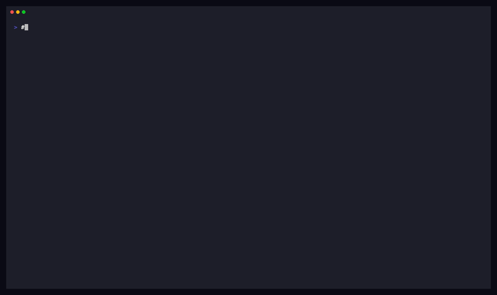

# pi-swival

A Pi package that integrates [Swival](https://github.com/Swival/swival) — a coding agent with a built-in reviewer loop, OS-enforced sandboxing, format-preserving secret encryption, and outbound request filtering — into Pi as a delegation target.



The package bundles:

- `swival-subagent` extension — dispatches tasks to a swival subprocess with reviewer loops, sandboxes, and structured reporting. Mirrors the shape of pi's example subagent extension but swaps the spawn target to swival.
- `swival` skill — drives swival from any Pi agent via the extension, with reference material on AgentFS sandboxing and proxy setup.
- `auditing-with-swival` skill — a three-stage recon → per-bucket → consolidate pipeline for security audits over codebases too large for one worker.
- `swival-audit` prompt template — slash-command-style invocation that walks an interactive operator through the audit pipeline.
- Seven swival agents — `swival`, `self-review-worker`, `test-runner`, `sandboxed-explorer` (general-purpose), plus `audit-worker`, `security-recon`, `security-consolidator` (audit pipeline).

## Install

```bash
pi install https://github.com/sheurich/pi-swival
```

Or pin a tag:

```bash
pi install git:github.com/sheurich/pi-swival@v1.0.0
```

Or install from a local checkout:

```bash
pi install /path/to/pi-swival
```

The package registers `extensions/`, `skills/`, and `prompts/` automatically per its `package.json` `pi` manifest. The seven bundled swival agents under `agents/` are discovered automatically by the extension at runtime — no symlinks or manual copies needed.

To override a bundled agent or add your own, place `.md` files in `~/.pi/agent/swival-agents/` (user scope) or `.pi/swival-agents/` in a project root (project scope). Discovery priority: project > user > bundled.

## Prerequisites

This package shells out to the `swival` CLI. Install it first:

```bash
uv tool install swival
# or: pipx install swival
```

See `skills/swival/references/setup.md` for the full setup walkthrough including the optional litellm proxy for Vertex AI and Bedrock cross-region inference.

## What's bundled

### Extension: `swival-subagent`

A Pi tool that dispatches single, parallel, or chained tasks to swival processes. Surfaces swival's structured `--report` JSON as the authoritative source of final output, status, and review-loop stats.

Key features beyond pi's example subagent extension:

- Reviewer loop (`selfReview` or test-as-contract `reviewer`) that retries until the reviewer accepts.
- AgentFS sandbox (`sandbox: agentfs`, or per-call `isolation`) that captures writes in a per-session SQLite overlay.
- Format-preserving secret encryption (`encryptSecrets`).
- LLM request auditing (`extraArgs: ["--llm-filter", "..."]`).
- Async / background runs with `status` / `resume` / `interrupt`, and a completion notice pushed into the caller's session.
- Credential preflight for selected providers and local endpoints; indeterminate results do not block dispatch. It checks ChatGPT OAuth artifacts, Bedrock through AWS STS, Google ADC artifacts for `vertexai`/`geap`, and TCP reachability for configured `generic`/`lmstudio`/`llamacpp` base URLs. Providers such as `google`, `huggingface`, `openrouter`, `applefm`, `command`, and unknown providers are not credential-validated.

See `skills/swival/SKILL.md` for dispatch examples and `extensions/index.ts` for the full schema.

### Skills

| Skill | Use |
|-------|-----|
| `swival` | Drive swival from any Pi agent — dispatch examples, agent authoring, capabilities reference, troubleshooting. |
| `auditing-with-swival` | Run a reproducible multi-bucket security audit over a codebase. Three stages with structured output contracts. |

### Prompts

| Prompt | Use |
|--------|-----|
| `swival-audit` | Slash-command-style invocation: `/swival-audit <repo-ref> [scope notes]`. Walks the operator through the audit pipeline. |

### Agents

Bundled in `agents/` for the `swival-subagent` tool:

| Agent | Use when |
|-------|----------|
| `swival` | Generic delegate — no system prompt, no review. The implicit default when `agent` is omitted. |
| `self-review-worker` | Implementation, file edits, or artifacts that should pass through `--self-review`; not for review-only tasks. |
| `test-runner` | Task has a runnable test command as acceptance criterion (caller passes `reviewerOverride`). |
| `sandboxed-explorer` | Exploratory changes you want to inspect before applying. |
| `audit-worker` | Read-only security or domain audit (Stage 2 of the audit pipeline). |
| `security-recon` | Survey a repository and emit `recon.json` (Stage 1 of the audit pipeline). |
| `security-consolidator` | Merge per-bucket audit reports into one consolidated findings document (Stage 3). |

The first four were extracted from the original `swival-subagent` Pi extension. The last three implement the audit pipeline documented in the `auditing-with-swival` skill.

Audit agents include built-in self-review with JSON / structure contract enforcement, an AgentFS sandbox, and a read-only command allowlist.

## Background runs

`async: true` returns a `runId` that is also the artifact directory basename, so `~/.pi/agent/swival-artifacts/<runId>/` holds the report, trace, stdout, and stderr for that run.

When a background run finishes, the extension pushes a completion notice into the caller session. The notice carries the outcome, a bounded output preview, and the artifact path. After Pi accepts the message, the notifier records the delivery in memory before it attempts to write `notified.json`. A reconciler scans completed artifacts for the active session.

When [`pi-subagents`](https://github.com/nicobailon/pi-subagents) is installed, live runs also register as background work, so `subagent_wait({})` and `subagent_wait({ all: true })` block on them. `subagent_wait({ id })` resolves subagent run ids only and will not resolve a swival run id.

`status` classifies a run as running, exited, or unknown. For a run recovered from disk, a live PID must match its process start time. A reused PID cannot read as alive, and an uncertain fate reads as unknown. Where the data exists, `status` also reports elapsed time, turn depth, last tool call, last activity, review round, and session cost.

Environment variables:

| Variable | Effect |
|----------|--------|
| `PI_SWIVAL_CACHE_DIR` | Cache root, overriding the default but not a per-call `cacheDirOverride` or agent `cacheDir`. |
| `PI_SWIVAL_NO_PREFLIGHT` | Skip the credential preflight when set to `1` or `true`; other values do not disable it. |
| `PI_SWIVAL_ARTIFACT_ROOT` | Redirect run artifacts away from `~/.pi/agent/swival-artifacts/`. |
| `PI_SWIVAL_TRUST_PROJECT_AGENTS` | Skip the confirmation prompt for project-local agents. |

## Layout

```text
pi-swival/
├── package.json                # Pi package manifest (pi.extensions, pi.skills, pi.prompts)
├── README.md
├── LICENSE
├── extensions/
│   ├── index.ts                # swival-subagent tool implementation
│   ├── agents.ts               # agent discovery from ~/.pi/agent/swival-agents/
│   ├── notify.ts               # completion notices and the artifact-root reconciler
│   ├── observability.ts        # liveness classification, cost and turn parsers, stderr filtering
│   ├── cache.ts                # cache-location resolution and the in-repo ignore guard
│   └── preflight.ts            # per-provider credential preflight
├── agents/                     # seven bundled swival agents (auto-discovered)
├── skills/
│   ├── swival/                 # SKILL.md, references/{agentfs,setup}.md, scripts/swival-proxy
│   └── auditing-with-swival/   # SKILL.md, references/{recon-contract,audit-prompt-template,consolidation-contract}.md
├── prompts/
│   └── swival-audit.md         # slash-command-style audit walkthrough
└── tests/                  # vitest harness for pure functions in extensions/
```

## Running the tests

The vitest harness covers pure functions and stub-runtime extension wiring. It tests argument building, report summaries, artifact persistence, trace parsing, bundled agents, completion notices, liveness, cache paths, credential preflight, and session lifecycle behavior. The harness never starts an actual `swival` process.

```bash
cd tests
./setup.sh           # first time only — installs vitest + symlinks pi peer deps
npx vitest run
```

From the package root:

```bash
npm test       # vitest only
npm run smoke  # manifest + frontmatter + pi-load checks
npm run ci     # smoke + vitest (mirrors CI)
```

The smoke test runs in under a second and validates: every path declared in `package.json#pi` resolves, every bundled agent has sane frontmatter, and `pi -e` loads the package without printing extension errors. It does not need an LLM provider — useful for clean CI runners.

GitHub Actions runs both layers on every push and pull request, against Node 20 and 22.

Commit `ac55843` added the JSON files under `tests/fixtures/` as regression fixtures. Repository history does not show whether they came from live Swival runs or synthetic data, so they are not an authoritative schema.

## End-to-end demo

Two recordings under [`demo/`](demo/):

- `demo-quick.gif` (~70s) shows a failing pytest run, a delegated repair via `self-review-worker`, reviewer acceptance, and the same tests passing. This is the headline demo embedded above.
- `demo-reviewer.gif` (~75s) shows `self-review-worker` creating and testing two Python files before Swival's reviewer accepts the result.

Regenerate with `make -C demo`. The recording harness uses a disposable checkout and home, disables ambient Pi resources, and refuses to run unless the installed Pi matches npm's latest release. See [`demo/README.md`](demo/README.md) for requirements and environment variables.

For a longer step-by-step tour covering AgentFS sandboxing and the `/swival-audit` prompt template, see [`examples/demo.md`](examples/demo.md).

## Tradeoffs vs pi's example subagent extension

Pi does not ship a subagent tool by default. The closest reference points are the [example subagent extension](https://github.com/earendil-works/pi/tree/main/packages/coding-agent/examples/extensions/subagent) under `examples/extensions/subagent/` in the pi-coding-agent repo, and third-party packages such as [`pi-subagents`](https://github.com/nicobailon/pi-subagents). The table below compares against the example extension; the third-party packages are similar in shape.

| Feature                   | example `subagent`    | `swival-subagent`     |
|---------------------------|-----------------------|-----------------------|
| Per-tool-call streaming   | yes (`--mode json`)   | post-run trace replay |
| Reviewer loop             | no                    | yes                   |
| Test-as-contract          | no                    | yes                   |
| AgentFS sandbox           | no                    | yes                   |
| Secret encryption         | no                    | yes                   |
| Parallel execution        | yes                   | yes                   |
| Chain mode (`{previous}`) | yes                   | yes                   |
| Async / background runs   | no                    | yes (single-mode only) |
| Completion notice to caller | n/a                 | yes                   |
| Credential preflight      | no                    | yes                   |
| Mid-run steering          | no                    | no                    |

Use the example subagent (or a third-party equivalent) when fine-grained tool-call visibility matters more than correctness checks. Use `swival-subagent` when correctness or sandboxing matters more than display fidelity. The two coexist — install both and pick per task.

## Known limitations

- Per-tool-call streaming comes from tailing swival's `--trace-dir` JSONL output and may lag on filesystems with weak `fs.watch` semantics.
- The system prompt body is passed as `--system-prompt` argv. Hundreds-of-KB bodies can hit platform `ARG_MAX`; split long guidance into a skills directory passed via `extraArgs` instead.
- Parallel tasks share the host working tree. `isolation: "agentfs"` gives each child its own overlay; without it, tasks that mutate overlapping files must be dispatched serially or given per-task `cwd` pointing at pre-created worktrees.
- `async: true` is single-mode only. Parallel and chain modes always run synchronously.
- Completion notices reach only the session that launched the run. A different session will not be told, by design.
- Session cost is parsed from swival's stderr, because `report.json` carries neither cost nor token totals. A run whose calls are all unpriced reports no cost rather than zero.
- There is no mid-run channel. swival exposes no control file, signal, or stdin reader outside its REPL, so a running child cannot be steered; `interrupt` and a fresh dispatch are the only options.
- Artifact directories under `~/.pi/agent/swival-artifacts/` are auto-pruned at 7 days. Back up reports you need longer.
- Swival's interactive `/goal` REPL command is not available here — the extension always invokes swival non-interactively.

## License

[MIT](LICENSE)
